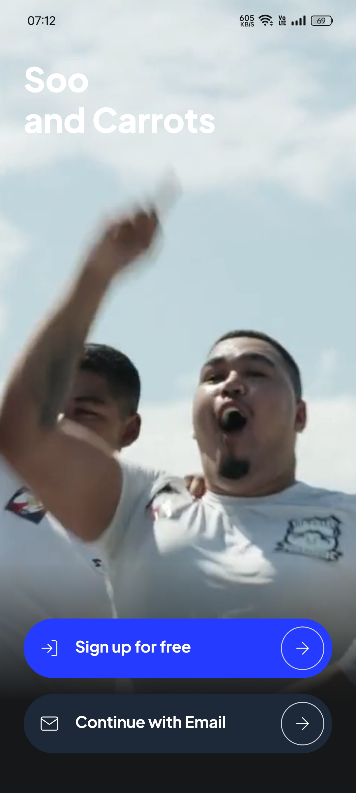
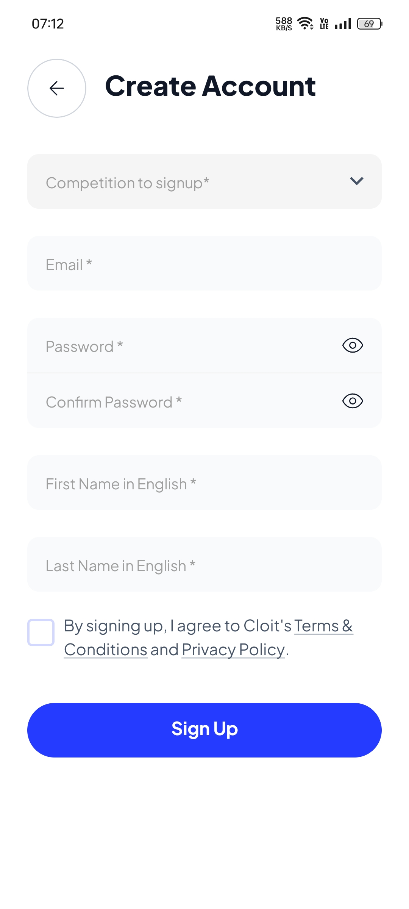
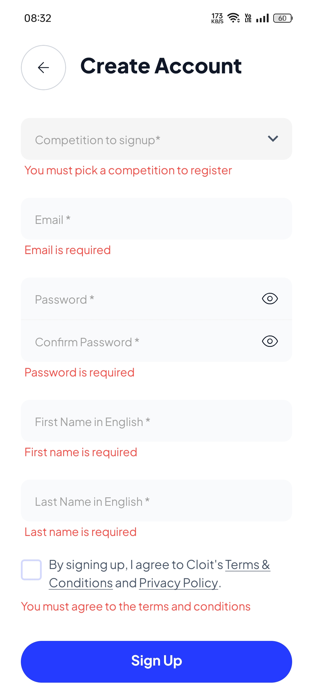
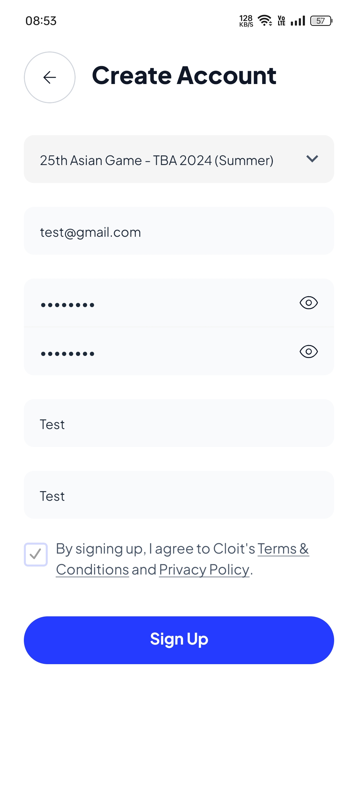
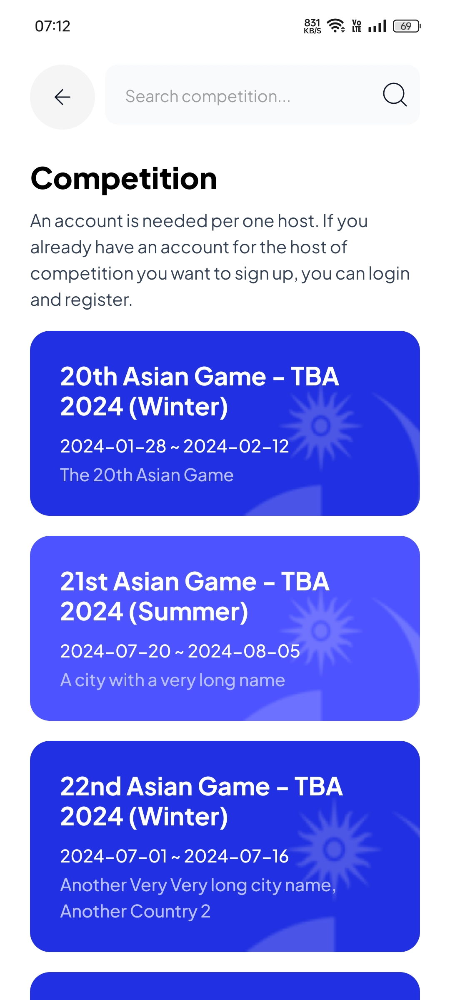
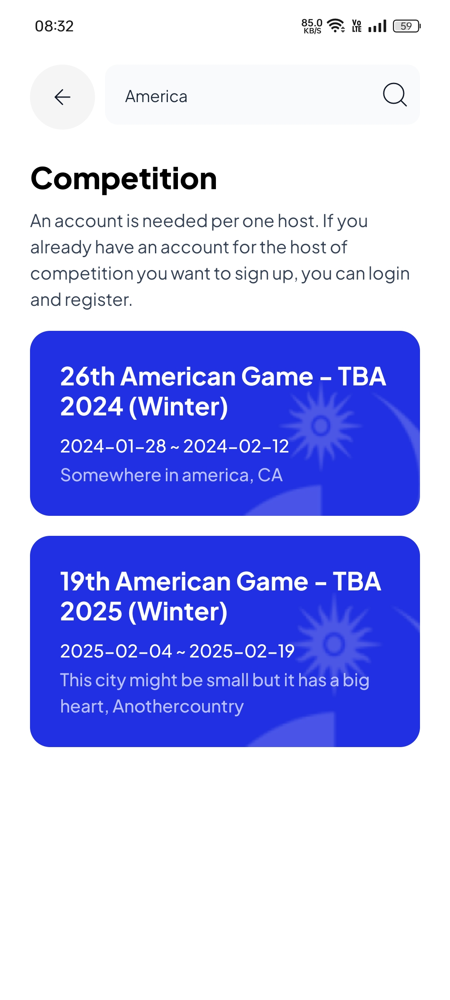
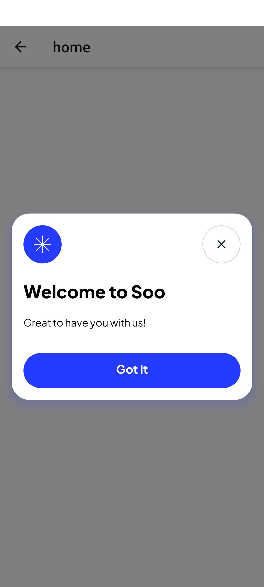
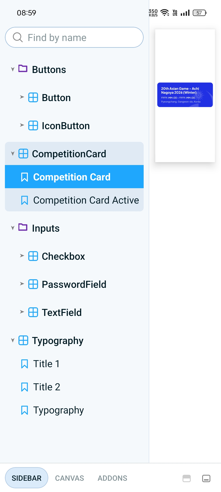

# Getting Started

Prerequisites:

- Node v18+ and npm (or yarn) installed on your machine (https://nodejs.org/en/download/package-manager)

## Installation:

- Clone this repository:

```bash

git clone git@github.com:cephaske254/soo-and-carrots.git
# OR
git clone https://github.com/cephaske254/soo-and-carrots.git
```

- Navigate to the project directory:

```bash
cd soo-and-carrots
```

- Install dependencies

```bash
npm install
```

## Running the App

There are several ways to run the Soo and Carrots app:

### 1. Development Server (Expo):

This is the recommended way to develop and test the app during development. It allows for live reloading whenever you make changes to the code.

- Start the development server:

```bash
npm run start
```

- Open the "Expo Go" app on your phone and scan the QR code displayed in the terminal. (must be connected to the same Wi-Fi network).

### 2. Specific Platform (Android/iOS):

To run the app on a specific platform (Android or iOS), you can use the following commands:

- Android:

```bash
npm run start:android
```

- iOS: (Requires a Mac computer)

```bash
npm run start:ios
```

### 3. Storybook:

Storybook is a tool for building UI components in isolation.

```bash
npm run start:storybook
```

## Available Scripts

The project includes various npm scripts to simplify development tasks:

- `start`: Starts the Expo development server.
- `start:android:` Starts the development server for Android.
- `start:ios`: Starts the development server for iOS (requires a Mac).
- `start:storybook`: Starts the Storybook development server.
- `storybook-generate`: Generates Storybook stories (refer to Storybook documentation).

### Screenshots

### 1. Onboarding



### 2. Register





### 3. Competitions




### 4. Home



### 5. Storybook


